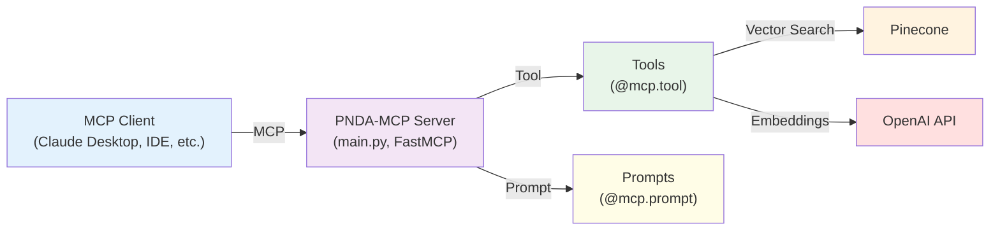
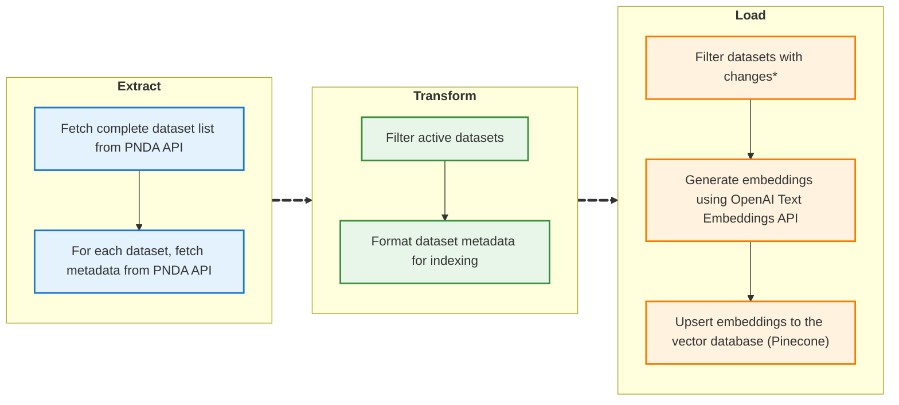

<div align="center">

# PNDA-MCP
#### **Model Context Protocol (MCP) Server for PNDA - National Open Data Platform / Plataforma Nacional de Datos Abiertos (Peru)**

---

### 👨‍💻 Author

**Ivan Yang Rodriguez Carranza**

[](mailto:ivanrodcar@outlook.com)
[](https://www.linkedin.com/in/irodcar)
[](https://github.com/rodcar)

</div>

---

## 📋 Table of Contents

- [🎯 Overview](#-overview)
- [🎬 Demo](#-demo)
- [🔧 Tools](#-tools)
- [💬 Prompts](#-prompts)
- [🚀 How to Use](#-how-to-use)
- [💡 Examples](#-examples)
- [🏛️ Architecture Diagram](#️-architecture-diagram)
- [🔄 ETL Pipeline](#-etl-pipeline)
- [📝 License](#-license)

---

## 🎯 Overview

PNDA-MCP is a **Model Context Protocol (MCP) server** for **Peru's National Open Data Platform (Plataforma Nacional de Datos Abiertos)**. Although Peru's open data platform [datosabiertos.gob.pe](https://datosabiertos.gob.pe) hosts valuable datasets, it can be a challenging for AI agents to find and retrieve the most relevant data for a specific data analysis question. PNDA-MCP simplifies this by providing tools and prompts that let AI agents or any MCP client (such as VS Code or Claude Desktop) easily search for and access datasets metadata, and associated data files. The goal is to enable data scientist agents or code agents to automatically discover and analyze public datasets.

This repository includes the ETL pipeline used to extract, transform, and index dataset references (see `etl` folder).

---

## 🎬 Demo

<div align="center">

</div>

Demo (Spanish):

---

## 🔧 Tools

| Name | Input | Description |
|------|-------|-------------|
| `dataset_search` | `query`, `top_k` | Search for relevant datasets from the PNDA (Plataforma Nacional de Datos Abiertos) Peru. `query` is the search text, `top_k` limits the number of results returned (max 25). |
| `dataset_details` | `id` | Get dataset details including title, metadata, and resources. Returns complete resource information: direct download URLs, file names, sizes, creation dates, MIME types, formats, states, and descriptions. |

---

## 💬 Prompts

| Name | Input | Description |
|------|-------|-------------|
| `question_generation` | `topic` | Generate 5 data analysis questions for any topic using available PNDA datasets. |
| `analysis_quick` | `question` | Create a minimal Jupyter notebook with quick data analysis addressing a question. |
| `analysis_full` | `question` | Create a complete Jupyter notebook with detailed data exploration and analysis addressing a question. |

---

## 🚀 How to Use

### **Local Server**

> **Note:** Make sure you have `uv` installed. If not, install it from [uv.tool](https://docs.astral.sh/uv/getting-started/installation/).

1. Clone and install:
   ```bash
   git clone https://github.com/yourusername/pnda-mcp.git
   cd pnda-mcp
   uv sync
   ```

2. Add to Claude Desktop config (Claude > Settings > Developer > Edit Config):

> **Note:** Replace `/path/to/pnda-mcp` with the actual path where you cloned the repository.

   ```json
   {
     "mcpServers": {
       "pnda_mcp": {
         "command": "uv",
         "args": [
           "--directory",
           "/path/to/pnda-mcp",
           "run",
           "main.py"
         ]
       }
     }
   }
   ```

### **MCP Inspector (Alternative)**

> **Note:** Requires `npx` which comes bundled with npm. If you don't have npm installed, install [Node.js](https://nodejs.org/) which includes npm.

> **Note:** Replace `/path/to/pnda-mcp` with the actual path where you cloned the repository.

Run:

```bash
npx @modelcontextprotocol/inspector \
  uv \
  --directory /path/to/pnda-mcp \                     
  run \
  main.py
```

Open MCP Inspector (URL displayed in the console) and configure the MCP client.

---

## 💡 Examples

| Prompt | Description | Usage |
|--------|-------------|-------|
| `tool_1` | Example usage | Coming soon |

---

## 🏛️ Architecture Diagram

PNDA-MCP follows the Model Context Protocol specification and provides a clean abstraction layer for PNDA functionality.



---

## 🔁 ETL Pipeline

The ETL pipeline is a core component that keeps the vector database of dataset references synchronized with Peru's National Open Data Platform. It can be run manually or automatically via cron jobs to ensure dataset information is always up-to-date.

The ETL pipeline processes PNDA datasets in three phases: **Extract** (fetches dataset metadata from PNDA API), **Transform** (cleans and structures the data), and **Load** (creates embeddings and stores them in Pinecone). This system uses a distributed task queue architecture with several key components working together seamlessly.

The architecture includes a **Pipeline Orchestrator** (`pipeline.py`) that serves as the main ETL coordinator, **Celery Workers** (`tasks/app.py`) for distributed task processing, **Redis** as the message broker and result backend, specialized **Task Modules** for each processing phase, and **Automation** through cron-based scheduling for regular updates.

### 📊 ETL Diagram



### 🔧 Components

#### Phase 1: Extract (`extract_tasks.py`)
- Fetches complete dataset list from PNDA API
- Retrieves individual dataset metadata and resources
- Handles API rate limiting and error recovery

#### Phase 2: Transform (`transform_tasks.py`)
- Filters active datasets only
- Extracts relevant resource metadata (URLs, sizes, formats, etc.)
- Structures data for embedding generation

#### Phase 3: Load (`load_tasks.py`)
- Generates embeddings using OpenAI API
- Implements incremental updates (only processes changed datasets)
- Stores vectors in Pinecone with metadata

#### Supporting Components
- **`pinecone_tasks.py`**: Index initialization and management
- **`logger_config.py`**: Centralized logging configuration
- **`celery_worker.sh`**: Worker startup script
- **`cron.sh`**: Automated execution script

### ⚙️ Configuration

The ETL pipeline requires the following environment variables:

```bash
# OpenAI Configuration
OPENAI_API_KEY=your_openai_key
OPENAI_EMBEDDING_MODEL=text-embedding-3-small

# Pinecone Configuration
PINECONE_API_KEY=your_pinecone_key
PINECONE_INDEX_NAME=pnda-mcp-index
PINECONE_DIMENSION=1536
PINECONE_METRIC=cosine
PINECONE_CLOUD=aws
PINECONE_REGION=us-east-1

# Celery Configuration
CELERY_BROKER_URL=redis://localhost:6379/0
CELERY_RESULT_BACKEND=redis://localhost:6379/0
WORKER_CONCURRENCY=4
```

### 🚀 Running the ETL

#### Manual Execution
```bash
# Start Celery worker
./etl/celery_worker.sh

# Run ETL pipeline
python -m etl.pipeline
```

#### Automated Execution
```bash
# Setup cron job (runs every 2 minutes)
crontab -e

# Add this line:
*/2 * * * * /path/to/pnda-mcp/etl/cron.sh

# Make script executable
chmod +x /path/to/pnda-mcp/etl/cron.sh
```

### 📁 Output

The ETL pipeline generates the following outputs:

- **`etl/results/responses_results.json`**: Raw extraction results
- **`etl/results/processing_results.json`**: Transformed dataset metadata
- **`etl/logs/etl.log`**: Comprehensive execution logs
- **Pinecone Index**: Vector embeddings for semantic search

### 🔍 Monitoring

Monitor ETL execution through:
- Log files in `etl/logs/`
- Celery worker status
- Pinecone index statistics
- Cron job execution logs

---

## 📝 License

This project is licensed under the [Apache License 2.0](LICENSE).

---
