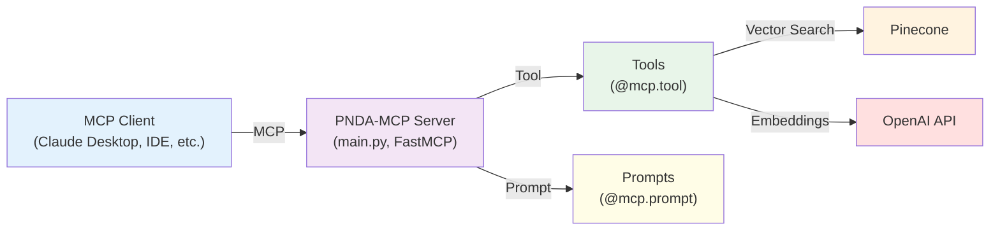
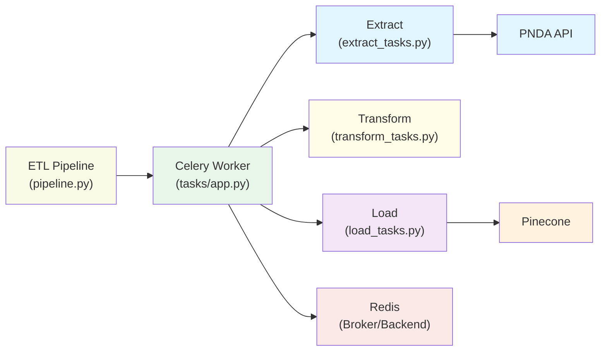

<div align="center">

# PNDA-MCP
#### **Model Context Protocol (MCP) Server for PNDA - National Open Data Platform / Plataforma Nacional de Datos Abiertos (Peru)**

---

### 👨‍💻 Author

**Ivan Yang Rodriguez Carranza**

[](mailto:ivanrodcar@outlook.com)
[](https://www.linkedin.com/in/irodcar)
[](https://github.com/rodcar)

</div>

---

## 📋 Table of Contents

- [🎯 Overview](#-overview)
- [🎬 Demo](#-demo)
- [🔧 Tools](#-tools)
- [💬 Prompts](#-prompts)
- [🚀 How to Use](#-how-to-use)
- [💡 Examples](#-examples)
- [🏛️ Architecture Diagram](#️-architecture-diagram)
- [📝 License](#-license)

---

## 🎯 Overview

PNDA-MCP is a **Model Context Protocol (MCP) server** for **Peru's National Open Data Platform (Plataforma Nacional de Datos Abiertos)**. Although Peru's open data platform [datosabiertos.gob.pe](https://datosabiertos.gob.pe) hosts valuable datasets, it can be a challenging for AI agents to find and retrieve the most relevant data for a specific data analysis question. PNDA-MCP simplifies this by providing tools and prompts that let AI agents or any MCP client (such as VS Code or Claude Desktop) easily search for and access datasets, their metadata, and associated data files. The goal is to enable data scientist agents or code agents to automatically discover and analyze public datasets.

---

## 🎬 Demo

<div align="center">

</div>

Demo (Spanish):

---

## 🔧 Tools

| Name | Input | Description |
|------|-------|-------------|
| `dataset_search` | `query`, `top_k` | Search for relevant datasets from the PNDA (Plataforma Nacional de Datos Abiertos) Peru. `query` is the search text, `top_k` limits the number of results returned (max 25). |
| `dataset_details` | `id` | Get dataset details including title, metadata, and resources. Returns complete resource information: direct download URLs, file names, sizes, creation dates, MIME types, formats, states, and descriptions. |

---

## 💬 Prompts

| Name | Input | Description |
|------|-------|-------------|
| `question_generation` | `topic` | Generate 5 data analysis questions for any topic using available PNDA datasets. |
| `analysis_quick` | `question` | Create a minimal Jupyter notebook with quick data analysis addressing a question. |
| `analysis_full` | `question` | Create a complete Jupyter notebook with detailed data exploration and analysis addressing a question. |

---

## 🚀 How to Use

### **Local Server**

> **Note:** Make sure you have `uv` installed. If not, install it from [uv.tool](https://docs.astral.sh/uv/getting-started/installation/).

1. Clone and install:
   ```bash
   git clone https://github.com/yourusername/pnda-mcp.git
   cd pnda-mcp
   uv sync
   ```

2. Add to Claude Desktop config (Claude > Settings > Developer > Edit Config):

> **Note:** Replace `/path/to/pnda-mcp` with the actual path where you cloned the repository.

   ```json
   {
     "mcpServers": {
       "pnda_mcp": {
         "command": "uv",
         "args": [
           "--directory",
           "/path/to/pnda-mcp",
           "run",
           "main.py"
         ]
       }
     }
   }
   ```

### **MCP Inspector (Alternative)**

> **Note:** Requires `npx` which comes bundled with npm. If you don't have npm installed, install [Node.js](https://nodejs.org/) which includes npm.

> **Note:** Replace `/path/to/pnda-mcp` with the actual path where you cloned the repository.

Run:

```bash
npx @modelcontextprotocol/inspector \
  uv \
  --directory /path/to/pnda-mcp \                     
  run \
  main.py
```

Open MCP Inspector (URL displayed in the console) and configure the MCP client.

---

## 💡 Examples

| Prompt | Description | Usage |
|--------|-------------|-------|
| `tool_1` | Example usage | Coming soon |

---

## 🏛️ Architecture Diagram

PNDA-MCP follows the Model Context Protocol specification and provides a clean abstraction layer for PNDA functionality.



---

## 🔄 ETL Pipeline Diagram



---

## 📝 License

This project is licensed under the [Apache License 2.0](LICENSE).

---


(correct)
./etl/celery_worker.sh

(correct)
python -m etl.pipeline


crontab -e

SHELL=/bin/bash
*/1 * * * * /Users/ivan/Workspace/mcp-projects/pnda-mcp/etl/cron.sh

ESC + :wq + ENTER

crontab -l

crontab -r

---
/Users/ivan/miniconda3/bin/python3

*/2 * * * * /Users/ivan/Workspace/mcp-projects/pnda-mcp/etl/cron.sh

SHELL=/bin/bash
*/2 * * * * /Users/ivan/Workspace/mcp-projects/pnda-mcp/etl/cron.sh

chmod +x /Users/ivan/Workspace/mcp-projects/pnda-mcp/etl/cron.sh

:wq

crontab -e

dd -> to delete
esc + :wq

crontab -l

crontab -r ->delete


SHELL=/bin/bash
*/1 * * * * /Users/ivan/Workspace/mcp-projects/pnda-mcp/etl/cron.sh
