<div align="center">

# PNDA-MCP
#### **Model Context Protocol (MCP) Server for PNDA - National Open Data Platform / Plataforma Nacional de Datos Abiertos (Peru)**

---

### 👨‍💻 Author

**Ivan Yang Rodriguez Carranza**

[](mailto:ivanrodcar@outlook.com)
[](https://www.linkedin.com/in/irodcar)
[](https://github.com/rodcar)

</div>

---

## 📋 Table of Contents

- [🎯 Overview](#-overview)
- [🎬 Demo](#-demo)
- [🔧 Tools](#-tools)
- [💬 Prompts](#-prompts)
- [🚀 How to Use](#-how-to-use)
- [💡 Examples](#-examples)
- [🏛️ Architecture Diagram](#️-architecture-diagram)
- [⚙️ ETL Pipeline](#️-etl-pipeline)
- [📝 License](#-license)

---

## 🎯 Overview

PNDA-MCP is a **Model Context Protocol (MCP) server** for **Peru's National Open Data Platform (Plataforma Nacional de Datos Abiertos)**. Although Peru's open data platform [datosabiertos.gob.pe](https://datosabiertos.gob.pe) hosts valuable datasets, it can be a challenging for AI agents to find and retrieve the most relevant data for a specific data analysis question. PNDA-MCP simplifies this by providing tools and prompts that let AI agents or any MCP client (such as VS Code or Claude Desktop) easily search for and access datasets metadata, and associated data files. The goal is to enable data scientist agents or code agents to automatically discover and analyze public datasets.

This repository includes the ETL pipeline used to extract, transform, and index dataset titles (see `etl` folder).

---

## 🎬 Demo

<div align="center">

</div>

Demo (Spanish):

---

## 🔧 Tools

| Name | Input | Description |
|------|-------|-------------|
| `dataset_search` | `query`, `top_k` | Search for relevant datasets from the PNDA (Plataforma Nacional de Datos Abiertos) Peru. `query` is the search text, `top_k` limits the number of results returned (max 25). |
| `dataset_details` | `id` | Get dataset details including title, metadata, and resources. Returns complete resource information: direct download URLs, file names, sizes, creation dates, MIME types, formats, states, and descriptions. |

---

## 💬 Prompts

| Name | Input | Description |
|------|-------|-------------|
| `question_generation` | `topic` | Generate 5 data analysis questions for any topic using available PNDA datasets. |
| `analysis_quick` | `question` | Create a minimal Jupyter notebook with quick data analysis addressing a question. |
| `analysis_full` | `question` | Create a complete Jupyter notebook with detailed data exploration and analysis addressing a question. |

---

## 🚀 How to Use

### **VS Code (Remote Server)**
> **Note:** Requires `npx` which comes bundled with npm. If you don't have npm installed, install [Node.js](https://nodejs.org/) which includes npm.

The fastest and easiest way to try this MCP is to use the 1-click installation button:

[](https://vscode.dev/redirect/mcp/install?name=pnda-mcp&config=%7B%22command%22%3A%22npx%22%2C%22args%22%3A%5B%22mcp-remote%22%2C%22https%3A%2F%2Fpnda-mcp.onrender.com%2Fmcp%22%5D%7D) [](https://insiders.vscode.dev/redirect/mcp/install?name=pnda-mcp&config=%7B%22command%22%3A%22npx%22%2C%22args%22%3A%5B%22mcp-remote%22%2C%22https%3A%2F%2Fpnda-mcp.onrender.com%2Fmcp%22%5D%7D&quality=insiders)

> **Note:** If the MCP tools and prompts do not load immediately, please try restarting VS Code.

Manual installation:

1. Open the Command Palette: `View > Command Palette` (or `Cmd+Shift+P` on Mac / `Ctrl+Shift+P` on Windows/Linux)
2. Type and select: `MCP: Add Server...`
3. Choose "Command (stdio)" as the server type
4. For "Command to run (with optional arguments)", enter: **`npx mcp-remote https://pnda-mcp.onrender.com/mcp`**
5. Set the name for the MCP server: `pnda-mcp`
6. Select where to save the configuration: User Settings saves the config globally for all projects. Workspace Settings saves it locally for just the current one.
7. Save the configuration
8. Restart VS Code for the MCP server to become available.

### **VS Code (Local Server)**

> **Important:** Before running the MCP server locally, you need to:
> 1. Have an OpenAI API key. Get your OpenAI API key from [platform.openai.com](https://platform.openai.com/).
> 2. Have a Pinecone account. If you don't have an account, you can sign up at [pinecone.io](https://www.pinecone.io/).
> 3. Configure your OpenAI API key and Pinecone API key in the `.env` configuration file. 
> 4. Run the ETL pipeline to index the datasets metadata from PNDA to Pinecone (see the [ETL Pipeline](#️-etl-pipeline) section below)

1. Open the Command Palette: `View > Command Palette` (or `Cmd+Shift+P` on Mac / `Ctrl+Shift+P` on Windows/Linux)
2. Type and select: `MCP: Add Server...`
3. Choose "Command (stdio)" as the server type
> **Note:** Replace `/path/to/pnda-mcp` with the actual path where you cloned the repository.
4. For "Command to run (with optional arguments)", enter: **`uv --directory /path/to/pnda-mcp run main.py`**
5. Set the name for the MCP server: `pnda-mcp`
6. Select where to save the configuration: User Settings saves the config globally for all projects. Workspace Settings saves it locally for just the current one.
7. Save the configuration
8. Restart VS Code for the MCP server to become available.

### **MCP Inspector (Alternative)**

> **Important:** Before running the MCP server locally, you need to:
> 1. Have an OpenAI API key. Get your OpenAI API key from [platform.openai.com](https://platform.openai.com/).
> 2. Have a Pinecone account. If you don't have an account, you can sign up at [pinecone.io](https://www.pinecone.io/).
> 3. Configure your OpenAI API key and Pinecone API key in the `.env` configuration file. 
> 4. Run the ETL pipeline to index the datasets metadata from PNDA to Pinecone (see the [ETL Pipeline](#️-etl-pipeline) section below)

> **Note:** Requires `npx` which comes bundled with npm. If you don't have npm installed, install [Node.js](https://nodejs.org/) which includes npm.

> **Note:** Replace `/path/to/pnda-mcp` with the actual path where you cloned the repository.

Run:

```bash
npx @modelcontextprotocol/inspector \
  uv \
  --directory /path/to/pnda-mcp \                     
  run \
  main.py
```

Open MCP Inspector (URL displayed in the console) and configure the MCP client with the following settings:
   - **Transport Type:** STDIO
   - **Command:** `python`
   - **Arguments:** `main.py`

---

## 💡 Examples

| Prompt | Input | Demo | Notebook | Language |
|--------|-------|---------|----------|----------|
| `question_generation` | Mining | [View Demo](https://example.com/) | - | English |
| `analysis_quick` | How has student enrollment at the National University of Engineering evolved between 2017 and 2023 by faculties and degree programs? | [View Demo](https://example.com/) | [View Notebook](examples/analysis_quick_ES.ipynb) | English |
| `analysis_full` | What types of fatal accidents are most frequent in the Peruvian mining industry, and in which departments do they occur most often? | [View Demo](https://example.com/) | [View Notebook](examples/analysis_quick_ES.ipynb) | English |
| `question_generation` | Minería | [View Demo](https://youtu.be/HzuxIuh2L6g) | - | Spanish |
| `analysis_quick` | ¿Cómo ha evolucionado la matrícula de estudiantes en la Universidad Nacional de Ingeniería entre 2017 y 2023 por facultades y carreras? | [View Demo](https://youtu.be/JMAa6UpCsEQ) | [View Notebook](examples/analysis_quick_ES.ipynb) | Spanish |
| `analysis_full` | ¿Qué tipos de accidentes mortales son más frecuentes en la industria minera peruana y en qué departamentos ocurren con mayor frecuencia? | [View Demo](https://youtu.be/dybtNQP33Sk) | [View Notebook](examples/analysis_full_ES.ipynb) | Spanish |

---

## 🏛️ Architecture Diagram

PNDA-MCP follows the Model Context Protocol specification and provides a clean abstraction layer for PNDA.

```mermaid
graph LR
    CLIENT[MCP Client<br/>VS Code, Cursor, etc.] --> MCP_SERVER[PNDA-MCP Server]
    
    subgraph TOOLS ["🔧 Tools"]
        DATASET_SEARCH[dataset_search]
        DATASET_DETAILS[dataset_details]
    end
    
    subgraph "💬 Prompts"
        QUESTION_GEN[question_generation]
        ANALYSIS_QUICK[analysis_quick]
        ANALYSIS_FULL[analysis_full]
    end
    
    MCP_SERVER --> DATASET_SEARCH
    MCP_SERVER --> DATASET_DETAILS
    MCP_SERVER --> QUESTION_GEN
    MCP_SERVER --> ANALYSIS_QUICK
    MCP_SERVER --> ANALYSIS_FULL
    
    DATASET_SEARCH -->|semantic search| PINECONE[Pinecone Vector Database]
    DATASET_SEARCH --> OPENAI[OpenAI Text Embeddings API]
    DATASET_DETAILS --> CACHE[Cache Layer]
    CACHE --> |fallback source| PNDA_API[PNDA API]
    CACHE --> |secondary fallback| PINECONE
    
    style CLIENT fill:#e3f2fd
    style MCP_SERVER fill:#f3e5f5
    style PNDA_API fill:#fff3e0
    style PINECONE fill:#fff3e0
    style OPENAI fill:#fff3e0
```



---

## ⚙️ ETL Pipeline

> **Important:** The following ETL documentation is only needed if you want to run the MCP locally or deploy your own MCP service. You can use the remote MCP service without running the ETL.

To search datasets using natural language, semantic search with text vector embeddings is used. The ETL pipeline handles the initial indexing and ongoing synchronization of the vector database containing dataset metadata from Peru's National Open Data Platform. It can be run manually or automatically via cron jobs to ensure the dataset information stays up to date.

### Requirements

- **Docker & Redis**: Runs Redis server locally which serves as a message broker and result backend to coordinate tasks during ETL pipeline execution with Celery workers.
- **OpenAI API key**: The OpenAI Text Embeddings API converts dataset titles into vectors using the text-embedding-3-small model. Get your OpenAI API key from [platform.openai.com](https://platform.openai.com/).
- **Pinecone account**: Dataset titles are indexed in Pinecone cloud vector database for semantic search. If you don't have an account, you can sign up at [pinecone.io](https://www.pinecone.io/).

### Setup and Usage

> **Note:** Make sure you have `uv` installed. If not, install it from [uv.tool](https://docs.astral.sh/uv/getting-started/installation/).

1. Clone and install:
   ```bash
   git clone https://github.com/rodcar/pnda-mcp.git
   cd pnda-mcp
   uv sync
   ```

2. Create `.env` file

   **MacOS/Linux:**
   ```bash
   cp .env.example .env
   ```

   **Windows:**
   ```cmd
   copy .env.example .env
   ```

3. Set your `OPENAI_API_KEY` and `PINECONE_API_KEY` values in the `.env` file.

   > **Note:** Get your OpenAI API key from [platform.openai.com](https://platform.openai.com/) and your Pinecone API key from [app.pinecone.io](https://www.pinecone.io/).
   
4. Run Redis with Docker
    > **Note:** Celery also supports other broker and backend options. See [Celery documentation](https://docs.celeryq.dev/en/stable/getting-started/backends-and-brokers/index.html) for more details.

    ```bash
    docker run -d -p 6379:6379 redis
    ```

5. Start Celery worker

   **MacOS/Linux:**
   ```bash
   ./etl/celery_worker.sh
   ```

   **Windows:**
   ```cmd
   uv run celery -A etl.tasks.app worker --loglevel=info
   ```
   
   > **Note:** The Celery worker processes ETL tasks asynchronously. Keep this terminal window open, you'll see task execution logs here when the pipeline runs.

6. Run the ETL pipeline

    The pipeline can be executed manually (on-demand) or automated using a cron job for daily execution. It is recommended to perform the initial indexing manually, then use the cron job to maintain data synchronization.

    **Manual Execution**:
    ```bash
    python -m etl.pipeline
    ```
    > **Note:** The execution might take several minutes. You can see the logs in the `etl/logs/etl.log` file, and the output files of intermediate ETL tasks in the `etl/results` folder.

    > **Note:** You can remove all pending the tasks from the Celery task queue with the following command: `celery -A etl.tasks.app purge -f`.

    **Scheduled with Cron Job (MacOS/Linux):**

    a. Make the script executable:
    > **Note:** Replace `/path/to/pnda-mcp/etl/cron.sh` with the actual path to the `cron.sh` file.
    ```bash
    chmod +x /path/to/pnda-mcp/etl/cron.sh
    ```

    b. Edit crontab:
    ```bash
    crontab -e
    ```

    c. Add this line (runs daily at 2 AM):
       
    > **Note:** Replace `/path/to/pnda-mcp/etl/cron.sh` with the actual path to the `cron.sh` file.

    > **Note:** If you are using vim, press `i` to enter insert mode and paste the cron job; press `Esc` to return to normal mode. Use `:wq` to save and exit.

    > **Note:** To change the hour replacing the 2 (which means 2 AM) with your desired hour in 24-hour format (e.g., 14 for 2 PM).

    ```bash
    0 2 * * * /path/to/pnda-mcp/etl/cron.sh
    ```

    d. Verify the cron job was added to the crontab:
    ```bash
    crontab -l
    ```
    
    The pipeline will execute daily at the time specified in the crontab configuration.

    > **Note:** You can see the logs in the `etl/logs/etl.log` file, and the output files of intermediate ETL tasks in the `etl/results` folder.

### ETL Diagram

The following diagram shows the three-stage ETL pipeline that processes dataset metadata from Peru's National Open Data Platform.


*Filters datasets where `metadata_modified` has changed since the last local version (`etl/results/processing_results.json`). This means the metadata must be updated in the vector database.


---

## 📝 License

This project is licensed under the [Apache License 2.0](LICENSE).

---

<div align="center">

[Report Bug](https://github.com/rodcar/bcrp-mcp/issues) · [Request Feature](https://github.com/rodcar/bcrp-mcp/issues)

</div>